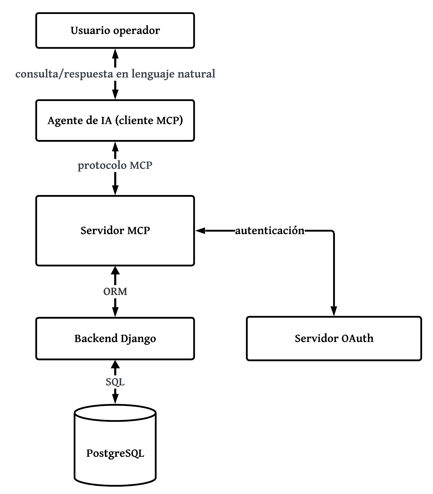

# Arquitectura del Sistema

La arquitectura del sistema se organiza en torno al **Model Context Protocol (MCP)**, que permite desacoplar el agente de inteligencia artificial utilizado por el usuario de las herramientas que proporcionan acceso a los datos y capacidades operativas del sistema.

Los principales componentes de la arquitectura son los siguientes:

* **Usuario operador:** persona perteneciente a una empresa cliente que formula consultas en lenguaje natural y recibe las respuestas generadas por el agente de inteligencia artificial. No interactúa directamente con el servidor MCP ni con la infraestructura interna del sistema.

* **Agente de inteligencia artificial (cliente MCP):** componente externo seleccionado por el usuario que interpreta las consultas formuladas en lenguaje natural, determina las herramientas MCP necesarias para resolverlas y genera la respuesta final a partir de los resultados obtenidos. La comunicación con el servidor MCP se realiza mediante el protocolo MCP.

* **Servidor MCP:** componente que actúa como intermediario entre el agente de inteligencia artificial y el backend del sistema. Expone las herramientas MCP disponibles para consultar información operativa y ejecutar capacidades analíticas. Antes de procesar una solicitud protegida, valida las credenciales de acceso y las restricciones de autorización correspondientes al usuario.

* **Servidor OAuth:** componente responsable de gestionar la autenticación y emisión de los tokens de acceso utilizados para acceder a los recursos protegidos. El servidor MCP utiliza esta información para validar las credenciales presentadas en las solicitudes y determinar el contexto de acceso del usuario.

* **Backend Django (ORM):** componente encargado de ejecutar la lógica de negocio asociada a las herramientas MCP y traducir las operaciones requeridas en consultas sobre los modelos de datos del sistema. Asimismo, aplica las restricciones de acceso correspondientes al espacio de trabajo del usuario.

* **PostgreSQL:** sistema gestor de bases de datos relacional encargado de almacenar la información operativa de campo utilizada por el sistema.

## Flujo general de interacción

El usuario operador formula una consulta en lenguaje natural mediante el agente de inteligencia artificial de su elección. El agente interpreta la consulta y determina qué herramienta o conjunto de herramientas MCP son necesarias para atenderla. Posteriormente, envía las solicitudes correspondientes al servidor MCP.

El servidor MCP valida las credenciales de acceso y el contexto de autorización del usuario antes de permitir la ejecución de las herramientas. Una vez autorizada la solicitud, la herramienta correspondiente interactúa con el backend Django, que ejecuta las operaciones requeridas sobre PostgreSQL aplicando las restricciones de acceso asociadas al espacio de trabajo.

Los resultados obtenidos son retornados al servidor MCP y posteriormente al agente de inteligencia artificial. Finalmente, el agente interpreta dichos resultados y genera una respuesta estructurada que es presentada al usuario operador.
