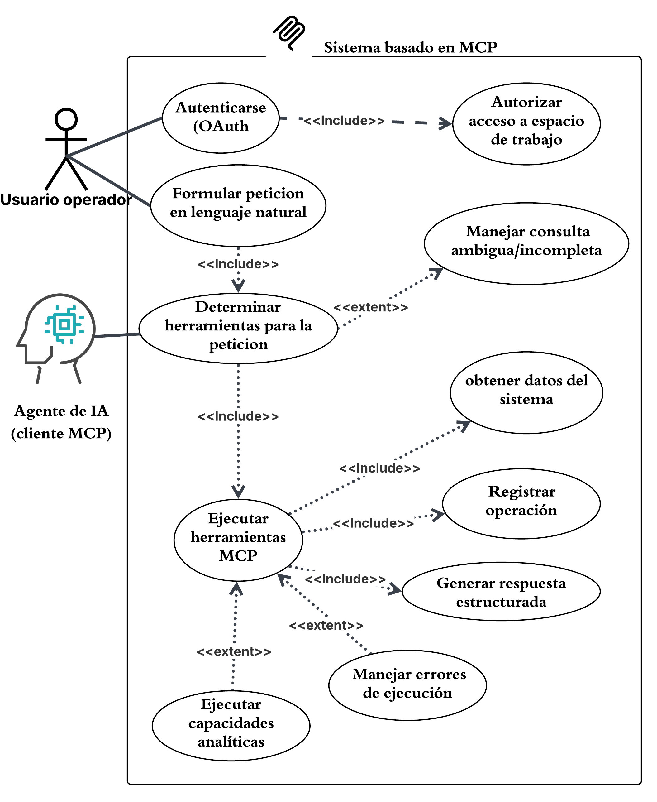

# Casos de uso
El sistema contempla dos actores principales: el Usuario operador, quien pertenece a una empresa cliente (workspace) y formula peticiones en lenguaje natural, y el Agente de IA (cliente MCP), un actor externo elegido libremente por el usuario, responsable de interpretar dichas peticiones y determinar qué herramientas MCP invocar.

El diagrama de casos de uso refleja el carácter read-only del sistema: toda interacción culmina en la obtención de datos del sistema y, opcionalmente, en la generación de un análisis agregado sobre dichos datos, sin contemplar casos de uso de escritura o modificación.

## Actores del sistema

En el sistema se identifican dos actores principales que intervienen en el procesamiento de las solicitudes: el **usuario operador** y el **agente de inteligencia artificial**. Cada actor desempeña un rol específico dentro del proceso de interacción y procesamiento de las consultas.

1. **Usuario operador:** Persona perteneciente a una empresa cliente de la plataforma que utiliza el sistema para realizar consultas relacionadas con la información operativa de campo de su organización. Es responsable de autenticarse en la plataforma y formular solicitudes mediante lenguaje natural.

2. **Agente de inteligencia artificial:** Servicio externo encargado del procesamiento del lenguaje natural que interpreta las solicitudes realizadas por el usuario, determina las herramientas MCP requeridas para atenderlas, ejecuta las operaciones correspondientes mediante el servidor MCP y procesa los resultados obtenidos para generar una respuesta estructurada al usuario.

## Especificación de casos de uso

### CU-01 Autenticarse

**Actor:** Usuario operador

**Descripción:** El usuario operador se autentica ante el sistema mediante el flujo OAuth2 para obtener un token de acceso que le permita, a través de su Agente de IA, invocar herramientas MCP protegidas.

**Precondiciones:**

* Existe una integración MCP previamente configurada por un administrador del workspace, con los scopes correspondientes autorizados.
* El usuario cuenta con credenciales activas y pertenece al workspace asociado a la integración.

**Flujo básico:**

1. El cliente MCP (Agente de IA) intenta conectarse al servidor MCP.
2. El sistema responde indicando que se requiere autenticación.
3. El cliente MCP inicia el flujo OAuth2 y redirige al usuario a la pantalla de inicio de sesión.
4. El usuario introduce sus credenciales.
5. El sistema valida que la cuenta esté activa, que el usuario pertenezca al workspace y que tenga permiso para utilizar integraciones MCP.
6. El sistema muestra al usuario los permisos (scopes) solicitados por la integración.
7. El usuario autoriza el acceso.
8. El sistema entrega un código de autorización temporal al cliente MCP.
9. El cliente MCP intercambia el código por un token de acceso mediante el flujo OAuth2 con PKCE.
10. El cliente MCP queda autenticado y puede proceder a invocar herramientas MCP.

**Flujos alternativos:**

* **Credenciales inválidas:** si el usuario introduce credenciales incorrectas, el sistema rechaza el inicio de sesión y solicita reintentar.
* **Usuario sin permiso de integración MCP:** si el usuario no cuenta con el permiso correspondiente, el sistema deniega la autenticación aunque las credenciales sean válidas.
* **Integración inactiva:** si la integración fue desactivada por un administrador, el sistema rechaza la solicitud de autenticación.

**Postcondiciones:**

* El cliente MCP cuenta con un token de acceso válido, asociado al usuario y a su workspace, que podrá utilizarse en solicitudes posteriores hasta su expiración o revocación.

### CU-02 Autorizar acceso

**Actor:** Agente de IA (cliente MCP), en representación del Usuario operador autenticado

**Descripción:** Una vez autenticada la solicitud, el sistema verifica en dos capas si la operación solicitada está permitida: el alcance (scope) autorizado por el token OAuth2, y el permiso específico del usuario dentro de su espacio de trabajo.

**Precondiciones:**

* El cliente MCP cuenta con un token de acceso válido (ver CU-01).
* La herramienta o colección solicitada tiene definidos los scopes y, cuando aplique, los permisos de workspace requeridos.

**Flujo básico:**

1. El Agente de IA invoca una herramienta o colección MCP utilizando el token de acceso.
2. El sistema verifica que el token cuente con el scope requerido por la herramienta solicitada.
3. Si la herramienta lo requiere, el sistema verifica adicionalmente que el usuario autenticado cuente con el permiso correspondiente dentro de su workspace.
4. Superadas ambas validaciones, el sistema delega la consulta al queryset de la herramienta, el cual aplica un filtrado adicional restringido al workspace del token.
5. El sistema permite la ejecución de la herramienta.

**Flujos alternativos:**

* **Scope insuficiente:** si el token no cuenta con el scope requerido, el sistema rechaza la solicitud sin ejecutar la herramienta.
* **Permiso de workspace insuficiente:** si el usuario no cuenta con el permiso requerido dentro de su workspace, el sistema rechaza la solicitud aunque el scope del token sea válido.
* **Colección exenta de permiso de workspace:** para colecciones como `workspace` o `totalstats`, el sistema omite la verificación de permiso de workspace por diseño, evaluando únicamente el scope OAuth.

**Postcondiciones:**

* La solicitud queda habilitada para ejecutarse exclusivamente sobre los datos del workspace autorizado, o rechazada si no supera alguna de las validaciones.

### CU-03 Determinar herramientas para la petición

**Actor:** Agente de IA (cliente MCP)

**Descripción:** El Agente de IA interpreta la consulta en lenguaje natural formulada por el usuario y determina cuál o cuáles herramientas MCP disponibles son necesarias para resolverla, con base en las herramientas expuestas por el servidor MCP.

**Precondiciones:**

* El Agente de IA cuenta con un token de acceso válido y autenticado (ver CU-01).
* El servidor MCP ha expuesto previamente el listado de herramientas disponibles para la integración correspondiente.

**Flujo básico:**

1. El usuario operador formula una consulta en lenguaje natural.
2. El Agente de IA analiza la consulta y la contrasta contra las herramientas MCP disponibles y sus descripciones.
3. El Agente de IA identifica la intención de la consulta y selecciona la herramienta o herramientas necesarias para resolverla.
4. El Agente de IA procede a ejecutar la o las herramientas seleccionadas (ver CU-04).

**Flujos alternativos:**

* **Consulta ambigua o incompleta:** si el Agente de IA no puede determinar con certeza qué herramienta corresponde a la consulta, se activa el caso de uso Manejar consulta ambigua/incompleta en lugar de proceder con la ejecución.
* **Consulta que requiere múltiples herramientas:** si la consulta requiere combinar información de más de una herramienta, el Agente de IA selecciona y secuencia la invocación de todas las herramientas necesarias.

**Postcondiciones:**

* Queda determinada la herramienta o conjunto de herramientas que se invocará para atender la consulta del usuario.

### CU-04 Ejecutar herramientas MCP

**Actor:** Agente de IA (cliente MCP)

**Descripción:** El Agente de IA invoca la herramienta o herramientas MCP previamente seleccionadas, las cuales operan sobre los modelos del sistema restringiendo el acceso a los datos del workspace autorizado del usuario.

**Precondiciones:**

* La solicitud superó las validaciones de autorización en dos capas (ver CU-02).
* La herramienta o herramientas a ejecutar fueron determinadas previamente (ver CU-03).

**Flujo básico:**

1. El Agente de IA invoca la herramienta MCP seleccionada, enviando los parámetros necesarios.
2. El sistema ejecuta la herramienta sobre los modelos correspondientes, aplicando el filtrado por workspace.
3. El sistema obtiene los datos solicitados (ver CU-05).
4. El sistema registra la operación realizada (ver CU-06).
5. El sistema entrega el resultado obtenido para la generación de la respuesta estructurada (ver CU-07).

**Flujos alternativos:**

* **Parámetros inválidos:** si los parámetros enviados por el Agente de IA no son válidos, el sistema interrumpe la ejecución y retorna un error estructurado, el cual también queda registrado (ver CU-06).
* **Ausencia de datos:** si la consulta no arroja resultados, el sistema retorna una respuesta indicando que no se encontraron datos, sin considerarse un error de ejecución.
* **Fallo de conexión o error interno:** si ocurre un fallo durante la ejecución, el sistema retorna un mensaje de error comprensible sin exponer información técnica sensible, y registra el incidente.
* **Consulta que requiere análisis agregado:** si la herramienta ejecutada corresponde a una capacidad analítica, se activa adicionalmente el caso de uso Generar análisis agregado de datos.

**Postcondiciones:**

* Los datos solicitados quedan disponibles para la generación de la respuesta estructurada, o el sistema retorna un error estructurado si la ejecución no pudo completarse.

### CU-05 Obtener datos del sistema

**Actor:** Agente de IA (cliente MCP)

**Descripción:** Herramienta MCP que recupera datos operativos de campo desde los modelos del sistema, restringidos al workspace autorizado.

**Precondición:** La solicitud superó las validaciones de autorización (ver CU-02).

**Postcondición:** Los datos solicitados quedan disponibles para su posterior procesamiento o entrega en la respuesta estructurada.

### CU-06 Generar análisis agregado de datos (analítica)

**Actor:** Agente de IA (cliente MCP)

**Descripción:** El sistema ejecuta capacidades analíticas especializadas sobre los datos operativos de campo, cuando la consulta del usuario requiere un análisis agregado en lugar de una simple recuperación de datos.

**Precondiciones:**

* La solicitud superó las validaciones de autorización en dos capas (ver CU-02).
* La consulta fue identificada como una que requiere una capacidad analítica, y no únicamente la obtención directa de datos (extiende a CU-04).

**Flujo básico:**

1. El Agente de IA invoca una herramienta MCP de tipo analítico, en lugar de una de consulta directa.
2. El sistema obtiene los datos operativos necesarios, restringidos al workspace autorizado.
3. El sistema procesa dichos datos aplicando la lógica analítica correspondiente a la herramienta invocada (por ejemplo, agregaciones o resúmenes sobre colecciones de datos).
4. El sistema retorna el resultado analítico obtenido.

**Flujos alternativos:**

* **Datos insuficientes para el análisis:** si no existen suficientes datos en el workspace para generar el análisis solicitado, el sistema retorna una respuesta indicándolo, sin considerarse un error de ejecución.

**Postcondiciones:**

* El resultado del análisis agregado queda disponible para la generación de la respuesta estructurada.

### CU-07 Manejar consulta ambigua/incompleta

**Actor:** Agente de IA (cliente MCP)

**Descripción:** Cuando el Agente de IA no puede determinar con certeza la intención de la consulta formulada por el usuario, o esta se encuentra incompleta, el sistema evita ejecutar una herramienta de forma incorrecta y en su lugar solicita información adicional o informa que la consulta no puede procesarse.

**Precondiciones:**

* El usuario formuló una consulta en lenguaje natural (ver CU-03).
* El Agente de IA no logró determinar con certeza qué herramienta o herramientas corresponden a la consulta.

**Flujo básico:**

1. El Agente de IA analiza la consulta y determina que esta es ambigua o no contiene la información suficiente para seleccionar una herramienta.
2. El sistema evita ejecutar cualquier herramienta MCP con base en una interpretación incierta.
3. El sistema genera una respuesta solicitando al usuario que aclare o complete su consulta.
4. El usuario proporciona la información adicional solicitada.
5. El flujo retorna al caso de uso Determinar herramientas para la petición, con la consulta ya aclarada.

**Flujos alternativos:**

* **Consulta no interpretable:** si tras la aclaración la consulta continúa sin poder interpretarse, o el usuario no proporciona la información solicitada, el sistema informa que la consulta no puede procesarse, sin ejecutar ninguna herramienta.

**Postcondiciones:**

* No se ejecuta ninguna herramienta MCP sobre datos del sistema hasta que la consulta sea correctamente interpretada, o el flujo finaliza informando al usuario que no puede procesarse.

### CU-08 Registrar operación

**Actor:** Sistema (registro automático, sin intervención directa del usuario)

**Descripción:** El sistema registra cada invocación de herramienta MCP, exitosa o fallida, incluyendo los datos de entrada, el resultado obtenido y los errores producidos, si los hubiera.

**Precondición:** Se ha ejecutado o intentado ejecutar una herramienta MCP (ver CU-04).

**Postcondición:** Queda almacenado un registro de auditoría de la operación, disponible para trazabilidad y revisión ante incidentes.

### CU-09 Generar respuesta estructurada

**Actor:** Agente de IA (cliente MCP)

**Descripción:** El sistema utiliza los resultados obtenidos mediante las herramientas MCP ejecutadas para construir una respuesta estructurada, coherente con la consulta original del usuario.

**Precondición:** La herramienta o herramientas invocadas retornaron un resultado o un error estructurado (ver CU-04, CU-05, CU-06).

**Postcondición:** El usuario recibe una respuesta en lenguaje natural, generada por el Agente de IA a partir de los datos entregados por el sistema.
