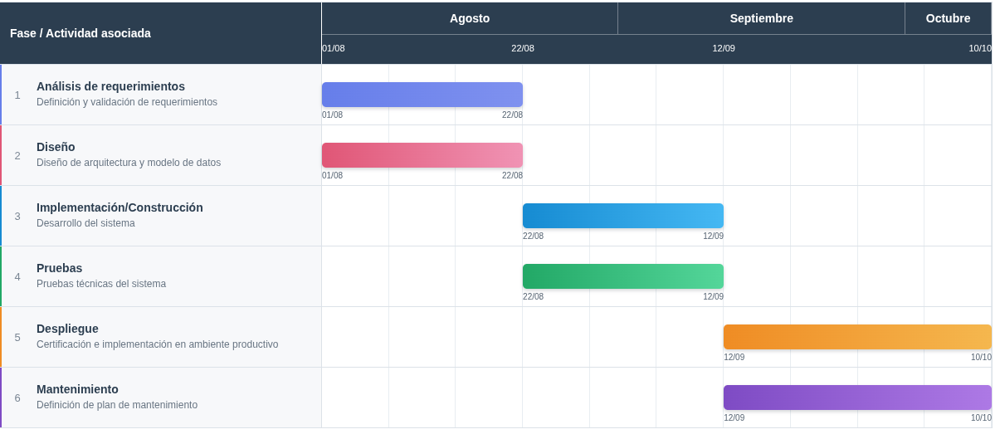

# Cronograma

El siguiente cronograma presenta la planificación de las actividades del proyecto organizadas conforme a las fases clásicas del ciclo de vida del desarrollo de software: análisis de requerimientos, diseño, implementación, pruebas, despliegue y mantenimiento. Cada fase agrupa las actividades técnicas y documentales correspondientes, alineadas con las fechas de entrega establecidas para el curso de Seminario de Tecnologías de Información

|  # | Fase del ciclo de vida      | Actividad asociada                                    | Fecha inicio | Fecha fin  |
| -: | --------------------------- | ----------------------------------------------------- | ------------ | ---------- |
|  1 | Análisis de requerimientos  | Definición y validación de requerimientos             | 01/08/2026   | 22/08/2026 |
|  2 | Diseño                      | Diseño de arquitectura y modelo de datos              | 01/08/2026   | 22/08/2026 |
|  3 | Implementación/Construcción | Desarrollo del sistema                                | 22/08/2026   | 12/09/2026 |
|  4 | Pruebas                     | Pruebas técnicas del sistema                          | 22/08/2026   | 12/09/2026 |
|  5 | Despliegue                  | Certificación e implementación en ambiente productivo | 12/09/2026   | 10/10/2026 |
|  6 | Mantenimiento               | Definición de plan de mantenimiento                   | 12/09/2026   | 10/10/2026 |

