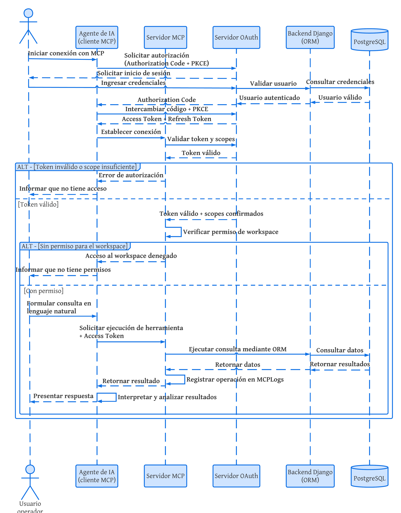

# Diagrama de Secuencia

El diagrama de secuencia ilustra el flujo temporal de interacciones entre los componentes del sistema durante el procesamiento de una consulta formulada por el usuario, desde la solicitud inicial en lenguaje natural hasta la entrega de la respuesta estructurada.

El diagrama contempla dos puntos de decisión críticos, correspondientes a las dos capas de seguridad implementadas por el servidor MCP: la validación del token de acceso y su alcance (scope) mediante el servidor OAuth, y la verificación del permiso del usuario sobre el espacio de trabajo (workspace) solicitado. Únicamente cuando ambas validaciones son superadas, el servidor MCP delega la operación al backend Django, el cual consulta la base de datos PostgreSQL y retorna los resultados correspondientes. Toda invocación, exitosa o fallida, es registrada por el servidor MCP conforme a lo establecido en el requerimiento RF-09.

En caso de que el token sea inválido o no cuente con el alcance necesario, el sistema interrumpe el flujo y retorna un error de autorización al agente de inteligencia artificial, quien lo comunica al usuario. De manera similar, si el token es válido pero el usuario no cuenta con permiso sobre el espacio de trabajo solicitado, el sistema deniega el acceso sin ejecutar la consulta sobre los datos. Solo cuando ambas condiciones se cumplen, el sistema ejecuta la operación solicitada y genera la respuesta final.
