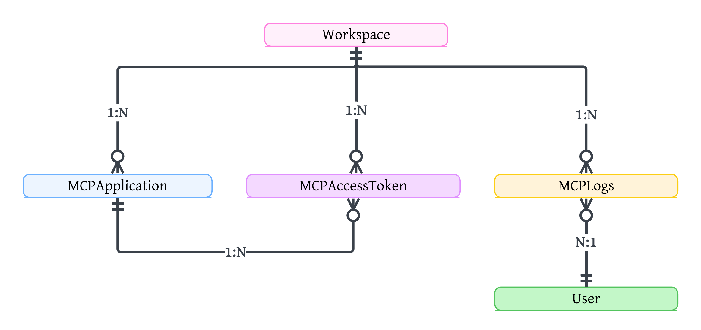

# Modelo de Datos

El sistema no requiere un esquema de base de datos independiente, sino que extiende el modelo de datos existente mediante tres entidades nuevas que habilitan la autenticación OAuth2 con aislamiento por espacio de trabajo (workspace), el registro de aplicaciones cliente y la auditoría de las invocaciones realizadas a través del servidor MCP. Las tres entidades se integran al modelo Workspace, ya definido previamente en el sistema.

* **Workspace (existente):** representa a la empresa cliente dentro de la plataforma. No fue modificado por el presente proyecto, pero constituye el eje de aislamiento (multi-tenancy) sobre el cual se relacionan las nuevas entidades.
* **MCPApplication:** representa una aplicación OAuth2, correspondiente a un agente de inteligencia artificial o cliente MCP (por ejemplo, Claude, ChatGPT, n8n), registrada y vinculada a un único espacio de trabajo. Permite que cada integración opere de forma aislada por empresa cliente, y almacena el estado de la aplicación (`is_active`) y los alcances (scopes) que le son permitidos solicitar.
* **MCPAccessToken:** representa el token de acceso OAuth2 emitido a una `MCPApplication`. El identificador del espacio de trabajo se desnormaliza directamente en el token al momento de su creación, permitiendo que el servidor MCP resuelva el tenant correspondiente en cada solicitud autenticada sin necesidad de consultas adicionales.
* **MCPLogs:** registra de forma auditable cada solicitud atendida por el servidor MCP, incluyendo la herramienta invocada (`tool_name`), los datos de entrada y salida (`request_data`, `response_data`), el resultado de la operación (`status_code`, `is_success`), los errores producidos (`error`) y metadatos de la solicitud (usuario, aplicación, workspace, tiempo de respuesta, dirección IP). Esta entidad da soporte directo al requerimiento de registro de operaciones (RF-09).
