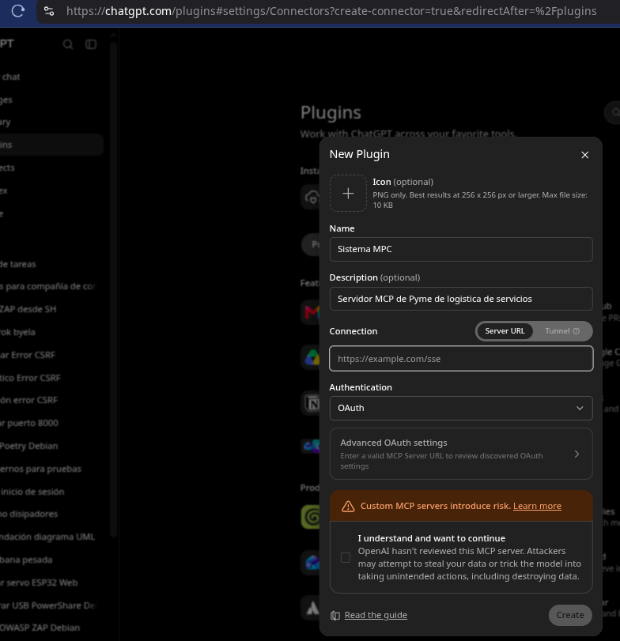
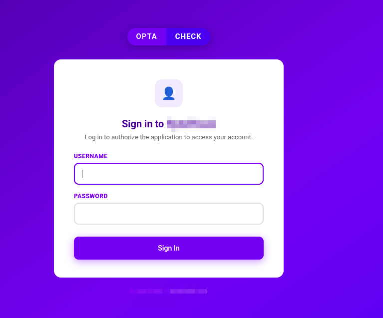
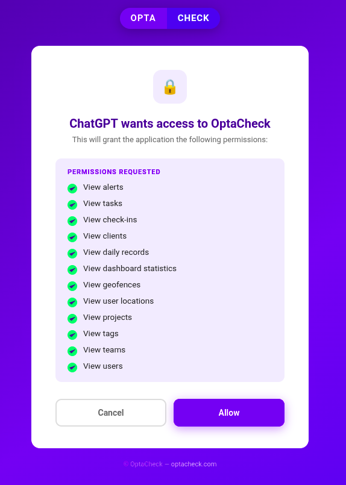
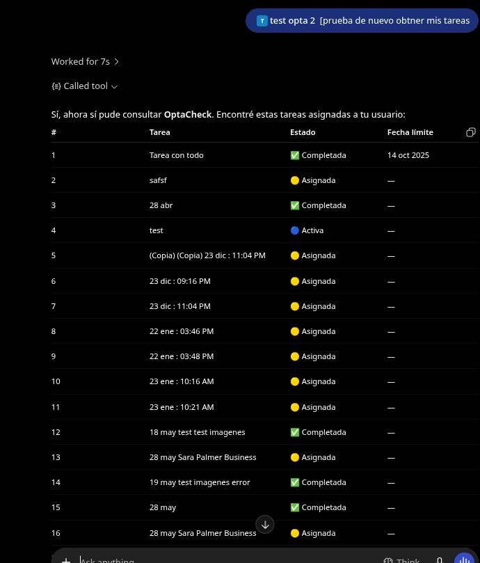
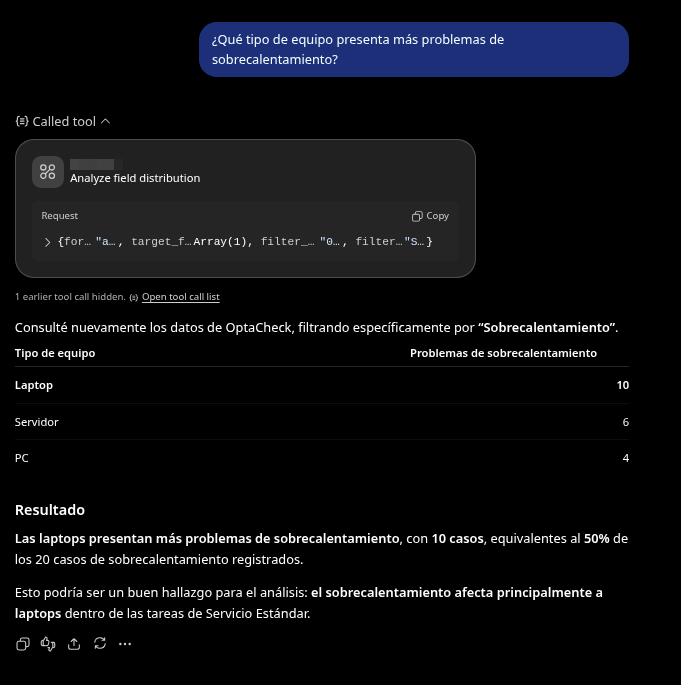
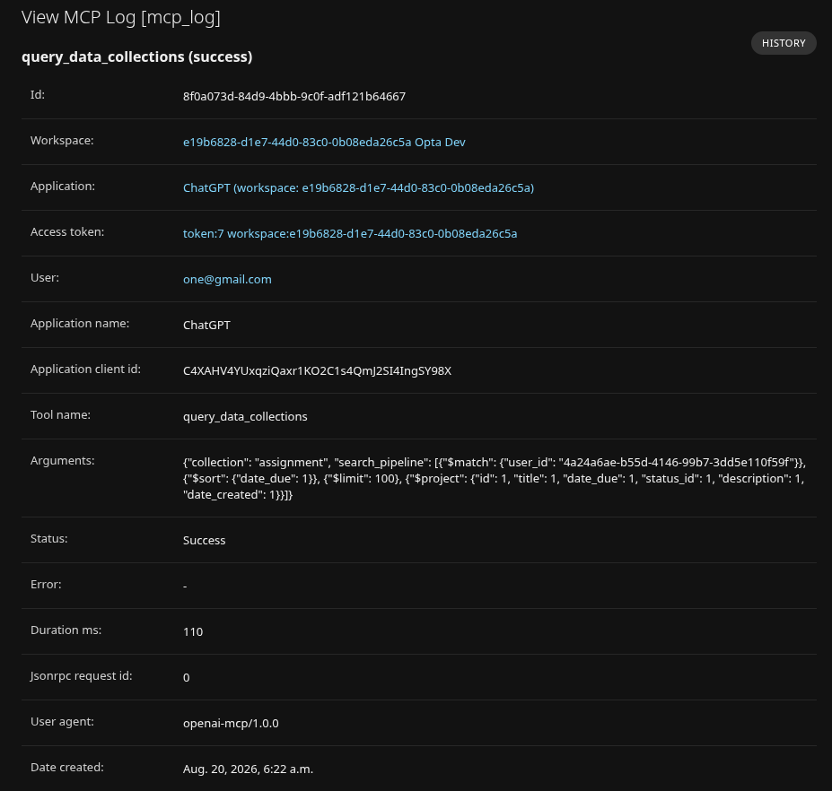

# Prototipo

El presente apartado tiene como propósito presentar evidencia visual del funcionamiento del sistema desarrollado bajo la arquitectura basada en Model Context Protocol (MCP), descrita en los capítulos anteriores del presente documento. A diferencia de una sección tradicional de mockups, en la cual se presentan bocetos o propuestas de diseño previas a la implementación, esta sección expone capturas de pantalla correspondientes al prototipo funcional ya construido, dado que al momento de la elaboración de este documento el sistema se encuentra en una etapa operativa de desarrollo.

Las capturas presentadas a continuación ilustran los principales flujos de interacción contemplados en el sistema, particularmente la comunicación entre el Usuario operador y el Agente de IA a través de consultas en lenguaje natural, así como los mecanismos administrativos de gestión de aplicaciones y tokens de acceso MCP. Cada captura se acompaña de una breve descripción y se vincula, cuando corresponde, con el requerimiento funcional (RF) que ilustra, a fin de mantener la trazabilidad metodológica establecida en secciones previas de este documento.

Es importante señalar que, en congruencia con el alcance definido para el sistema, las capturas presentadas corresponden exclusivamente a operaciones de consulta y visualización de datos operativos. No se incluyen evidencias de operaciones de creación, actualización o eliminación de datos, dado que dichas funcionalidades se encuentran explícitamente fuera del alcance del presente proyecto.

## Autenticación y acceso

El proceso de autenticación del sistema inicia con la incorporación del servidor MCP como un plugin dentro del cliente de IA utilizado por el operador, para lo cual basta con proporcionar la URL correspondiente al servidor MCP, sin requerir la configuración manual de credenciales de tipo Client ID u otros parámetros técnicos adicionales, ya que dicho intercambio es gestionado automáticamente por el propio servidor MCP conforme al protocolo OAuth2.

Una vez agregado el plugin, el sistema redirige al operador hacia una página de autenticación en la cual debe ingresar sus credenciales de usuario (usuario y contraseña). Tras validar dichas credenciales, el sistema notifica al operador el alcance (scope) de permisos que serán otorgados al plugin dentro de su sesión, permitiéndole conocer de forma explícita a qué datos y funcionalidades tendrá acceso el Agente de IA antes de completar el proceso de autorización.

Finalizado este proceso, el plugin correspondiente al servidor MCP queda disponible dentro del cliente de IA, habilitando al operador para iniciar consultas en lenguaje natural sobre los datos operativos a los cuales tiene acceso autorizado.

## Interacción con el Agente de IA

Una vez autenticado y habilitado el plugin correspondiente al servidor MCP, el operador puede realizar consultas en lenguaje natural directamente a través del cliente de IA, sin necesidad de conocimientos técnicos sobre bases de datos o lenguajes de consulta estructurados. El Agente de IA interpreta la solicitud, invoca las herramientas MCP correspondientes y retorna una respuesta procesada en lenguaje natural, acompañada en muchos casos de tablas o resúmenes estructurados que facilitan la interpretación de los datos operativos.

A continuación se presentan dos ejemplos representativos de este tipo de interacción. En el primero, el operador solicita un listado general de tareas, obteniendo como respuesta un conjunto ordenado por fecha de creación con su estado y fecha de vencimiento correspondiente. En el segundo ejemplo, el operador realiza una consulta de tipo analítico, solicitando identificar qué tipo de equipo presenta mayor incidencia de problemas de sobrecalentamiento; en este caso, el Agente de IA no solo retorna los datos correspondientes organizados en una tabla comparativa por tipo de equipo, sino que además genera una interpretación textual del resultado, señalando el tipo de equipo con mayor incidencia y el porcentaje que representa dentro del total de casos registrados.

Estos ejemplos evidencian la capacidad del sistema para resolver tanto consultas descriptivas simples (listados) como consultas analíticas que requieren agregación y comparación de datos, sin que el operador deba tener conocimiento previo de la estructura de la base de datos ni de los criterios técnicos de filtrado aplicados.

## Auditoría y trazabilidad

Con el propósito de mantener un control a nivel de seguridad sobre el uso del sistema, cada invocación realizada por el Agente de IA a través de las herramientas del servidor MCP queda registrada de forma automática en el modelo MCPLogs, el cual es consultado mediante la interfaz administrativa de Django (Django Admin). Esta interfaz permite a los administradores del sistema revisar de manera detallada el historial de solicitudes procesadas, sin que dicha información sea visible ni accesible para el operador de campo.

Cada registro de auditoría almacena, entre otros datos, el workspace desde el cual se originó la solicitud, la aplicación cliente utilizada (por ejemplo, un cliente de IA compatible con el protocolo MCP), el token de acceso empleado, el usuario autenticado, el nombre de la herramienta MCP invocada, los argumentos enviados en la solicitud, el estado de la operación (éxito o error), el tiempo de duración del procesamiento en milisegundos y la fecha de creación del registro. En el caso de operaciones fallidas, el registro almacena adicionalmente el detalle del error ocurrido.

Este mecanismo de auditoría resulta fundamental para el modelo de seguridad del sistema, ya que permite identificar de forma trazable qué aplicación, usuario y workspace ejecutó una determinada consulta, así como los parámetros exactos utilizados, contribuyendo tanto a la detección de comportamientos anómalos como al análisis de uso del sistema por parte de los distintos workspaces autorizados.

